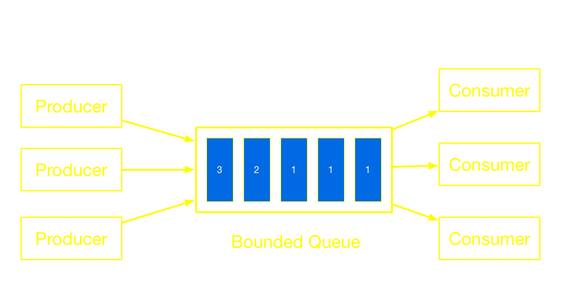
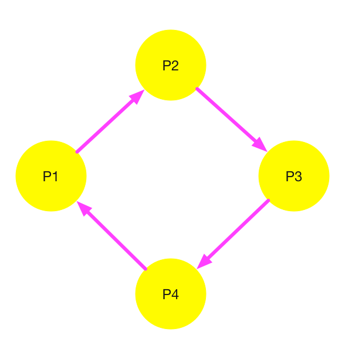
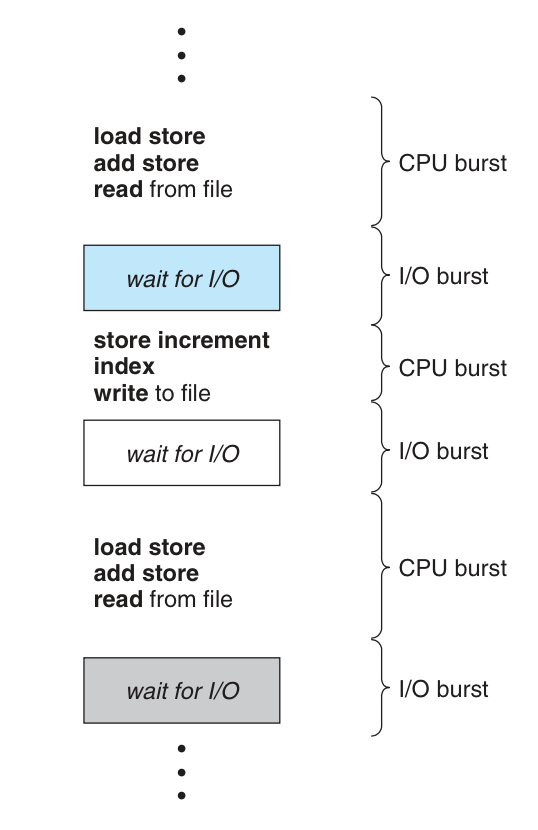
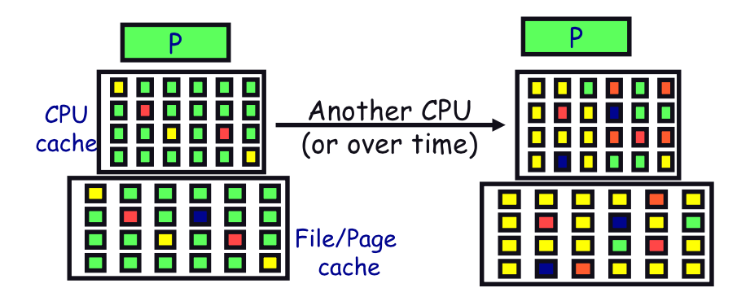
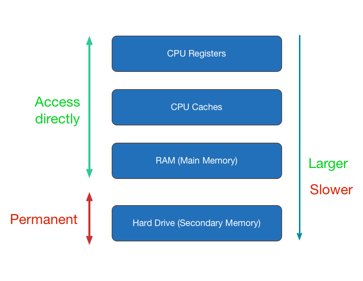
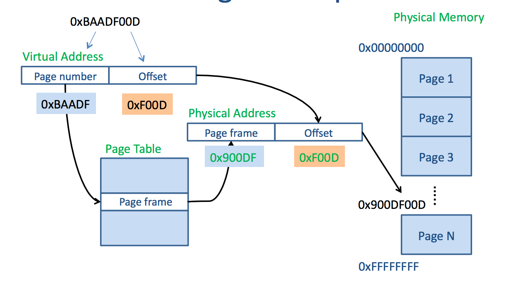
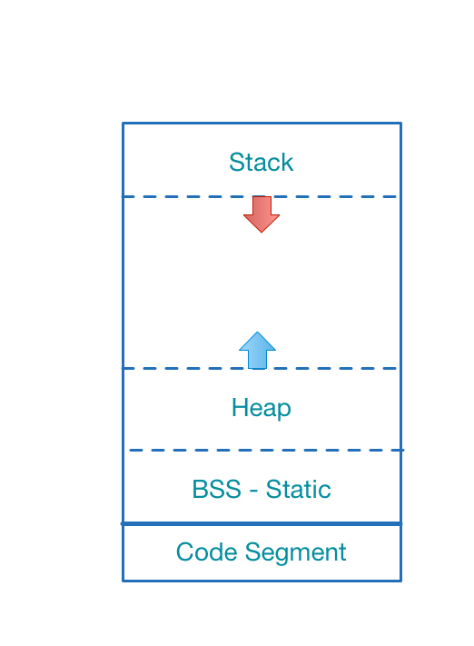

# COMP 346
# Review
### https://github.com/comp346/W15

---
# Agenda
1. Functionality of Operating System
2. Concurrent Programming
3. Liveness
4. Synchronization
5. CPU Scheduling
6. Virtual Memory

---
#  Operating System

- Interacts with hardware
- Manages resources (CPU Cycles & Memory)
- Provide services for applications


---
# OS Features
- Process management
- Memory management
- File system
- Peripheral devices
- Networking
- Security

---
#  Concurrent Programming
**Advantages**
- Better utilize CPU
- Increase responsiveness

**Disadvantages**
- Nondeterministic
- Safety
- Liveness
- Context Switch (can downgrade performance)

---
# Utilize CPU

**Amdahl's Law**


**N** is number of cores
**F** is fraction of serial code

**Serial code must be execute sequentially**

---
# Amdahl's Law


---
# Nondeterministic
- Hard to reproduce the problem
- In the assignments, results are intermittent

---
# **SAFETY**
#[fit] Something bad never happens

---
# **LIVENESS**
#[fit] Something good eventually happens

---
# Safety vs Liveness 
Using synchronization 

- To achieve **safety** 
- But can prevent **liveness**

---
# Liveness Issues
1. Starvation 
2. Livelock
3. Poor responsiveness
4. **Deadlock**

---
# Starvation
Starvation describes a situation where a thread is unable to gain regular access to shared resources and is unable to make progress.



---
# Livelock
Participants continuously change their state in response to the action of another thread

1. A move to his left to let B pass
2. B move to his right to let A pass


---
# Poor Responsiveness
- Common in GUI applications
- Occurs when user interface freeze

## Solution
Heavy tasks should be executed in background

---
# Deadlock
Deadlock arises when several participants are waiting on each other to reach a specific state to be able to progress. 

As none of them can progress without some other participant to reach a certain state.

---
# Dining Philosophers
Eating requires 2 chopsticks


---
# Deadlock occurs if all hold
1. **Mutual Exclusion:** at least one process exclusively uses a resource
2. **Hold and wait:** a process holds at least one resources and needs more, which are held by others
3. **No preemption:** resources are released only in voluntary manner
4. **Circular wait:** P1 → P2 → … → PN → P1

---
# Deadlock Analysis
- Processes are nodes
- Edges are resource relations
- Cyclic => Deadlock



---
# Locking order

```java
public void transferMoney(Account fromAcc, 
                          Account toAcc, amount) {
  synchronized (fromAcc) { 
    synchronized (toAcc) {
      fromAccount.debit(amount);
      toAccount.credit(amount);
    }
  }
}   
```
Can deadlock occur ?

---
# Deadlock happens if

A transfer to B and B transfer to A at the same time.

- transferMoney(A, B, _);
- transferMoney(B, A, _);

---
# Deadlock Summary

1. Deadlock is one of the biggest issues of concurrency
2. Deadlock is not obvious
3. Four conditions of deadlock

---
# Synchronization
1. Semaphore
2. Mutex == Binary Semaphore
3. SpinLock
4. ReentrantLock
5. Barrier
6. Monitor

---
# SpinLock vs Mutex
- SpinLock keeps polling resource until acquired
- Mutex is a more polite, wait until notified

**Modern Lock:** Hybrid implementation

---
# ReentrantLock
- A lock with ownership
- Once owned, can call "lock" multiple times

---
# No deadlock with Ownership
```java
class Stack {
  ReentrantLock lock = new ReentrantLock();
  public E peek(){
    try{
      lock.lock();
      if(isEmpty())throws EmptyStackException
      return topElement;
    }finally{
      lock.unlock();
    }
  }

  bool isEmpty(){
    try{
      lock.lock();
      return length == 0;
    }finally{
      lock.unlock();
    }
  }
}
```

---
# Deadlock without Ownership
```java
class Stack {
  Semaphore lock = new Semaphore(1);
  public E peek(){
    try{
      lock.lock();
      if(isEmpty())throws EmptyStackException
      return topElement;
    }finally{
      lock.unlock();
    }
  }

  bool isEmpty(){
    try{
      lock.lock(); //Deadlock here when called inside peek()
      return length == 0;
    }finally{
      lock.unlock();
    }
  }
}
```

---
# Locking pattern

```java
try{
  lock.lock();
  //do something
  //Even return here
}finally{
  lock.unlock();
}
```

---
#[fit] `synchronized` is `ReentrantLock`

---
# Process states


---
# Process Execution
- Computation uses CPU
- I/O does not use CPU



---
# CPU Scheduling
Having **N** programs & **K** processors

**Wants:**
1. Maximize "throughput"
2. Minimize "turnaround time"
3. Minimize "response time"

#[fit] Which jobs to assign to which CPU, and how long?

---
# Criterion
- **Throughput**
Number of jobs complete per unit of time
*Higher is better*

- **Turnaround time**
Time for each job to complete after submit
*Lower is better*

- **Response time**
Time from request to the first response
*Lower is better*

---
# Context Switching
Happens when save current execution, restore previous execution

- Save & restore registers
- Switch address spaces (expensive)

---
# Hidden cost
- Cache outdated
- Page fault



---
# Memory Hierarchy



---
# Virtual Memory


---
# How Virtual Memory works
- Application accesses its virtual memory
- Memory is divided up into pages (fixed size)
- CPU & OS handle mapping

---
# Address Translation


Translation is done by MMU (Memory Management Unit)

---
# InProcess Memory Structure



Data Segment
  - BSS
  - Heap
  - Stack

Data Segment is dynamic
Code Segment is readonly

---
# Stack
Behaves like `Regular Stack` (LIFO)

**Push when**
  - Enter scope (function or loop)
  - Declare primitive variables

**Pop when**
  - Exit scope (function or loop)

---
# StackOverflow
- Overflow when calling many functions nestly
- Common issue of non-tail recursive functions

---
```java
class Overflow {
  static int count = 0;
  static void repeat(){
    count += 1;
    repeat();
  }

  public static void main(String[] args){
    try{
      repeat();
    }catch(Throwable e){
      System.err.println("Completed times: " + count);
      System.err.println("Reason: " + e);
    }
  }
}
```

Completed times: 22127
Reason: java.lang.StackOverflowError

---
# Manage Stack Segment
- No, it is handled automatically by process
- Avoid "very long recursive calls"

---
# Heap
- Dynamic allocation memory
- Allocated memory when creating objects
- Deallocated memory when release objects

---
# Manage Heap
1. **Manual Heap**
  - C: malloc/free 
  - C++: new/delete

2. **Garbage Collection(GC)**
  Java, C#, Javascript
3. **Reference Counting**
  Swift, Objective-C, Rust, C++

---
# OutOfMemory
```java
class OutOfMemory {
  public static void main(String[] args){
    int GB = 1024 * 1024 * 1024;
    Object[]os = new Object[GB];
  }
}
```
Exception in thread "main" java.lang.OutOfMemoryError: Java heap space
  at OutOfMemory.main(OutOfMemory.java:4)

---
# Cyclic Reference
- `Object A` has **STRONG** reference to `B`
- `Object B` also has **STRONG** reference to `A`
- GC or ARC can not break **CYCLIC REFERENCE**
- GC languages still have `Memory Leaks` issues

---
# Thank you very much


