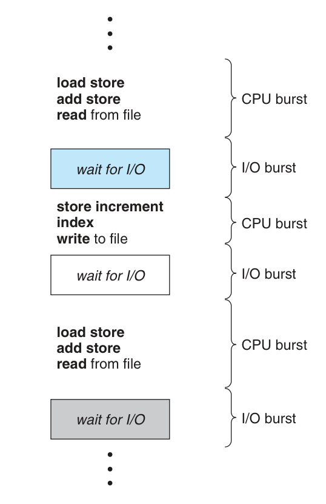
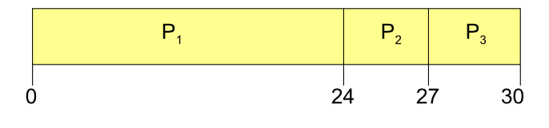
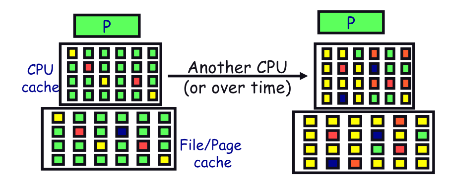

# CPU Scheduling

---
# Process states

---
# Process Execution
- Computation & I/O
- Computation uses CPU(Running)
- Interacts I/O (Waiting)
- I/O means network, file...

---
# Scheduling Problem
- Have k jobs ready to run
- Have N CPUs

#[fit] Which jobs to assign to which CPU, and how long?

---
# Criterion
1. Throughput
2. Turnaround time
3. Response time

---
#[fit] Throughput
#[fit] "Number of jobs complete per unit of time"
## Higher is better

---
#[fit] Turnaround time
#[fit] "Time for each job to complete after submit"
## Lower is better

---
#[fit] Response time
#[fit] "Time from request to the first response"
## Lower is better

---
#[fit] Waiting time
#[fit] "Total time that job waits in ready queue"
## Users do not see it

---
# Scheduling Goals
1. Maximize "throughput"
2. Minimize "turnaround time"
3. Minimize "response time"

**Optimize average or bounded values?**
For example, to guarantee that all users get good service, we may want to minimize the maximum response time.

---
# Can reach goal if
1. Maximize CPU utilization
2. Maximize I/O utilization

**Notes**
1. Overlap I/O & computation => increase utilization
2. I/O will be idle until triggered by "short CPU"

---
# Scheduler
- First come first served
- Shortest Job First
- Round Robin

---
# FCFS Scheduling
P1 needs 24 seconds, P2 & P3 need 3 seconds

- Throughput: 3/30 = 0.1 jobs/second
- Turnaround: (24 + 27 + 30)/ 3 = 27
- If order is "P2 P3 P1", turnaround = (3 + 6 + 30)/3

---
# Convoy Example
Line of customers: C1, C2, C3, C4
- C1 needs 2 hours
- C2, C3 & C4 needs 30 seconds to have signatures then sends to other departments

---
# Convoy Effect
- Long computation process hold the CPU
- Queued I/O processes needs "short CPU" to trigger I/O operations

---
# Shortest Job First

Schedule the job whose next CPU burst is the shortest

(Preemptive => Shortest Remaining Time First)

---
# Advantages of SJF
Minimize waiting time for set of given jobs

# Limitation of SJF
- Doesn't always minimize average turnaround time
- Can lead to unfairness or starvation

---
# Round Robin
- Similar to FCFS but time is sliced
- Time slice, quantum: 10 - 100 milliseconds
- Ready queue is circular queue (FIFO)

---
# Advantages of RR
- Fairness
- Low average waiting time
- Good responsiveness

---
# Time slice value
- Too large becomes FCFS
- Too small "Context Switching" cost

---
# Other schedulers
- Realtime scheduler
- Multiprocessors scheduler

---
# Context Switching
Happens when save current execution, restore previous execution

- Save & restore registers
- Switch address spaces (Expensive)

---
# Hidden cost
- Cache outdated
- Page fault

---
#[fit] Context-Switch is expensive operation
