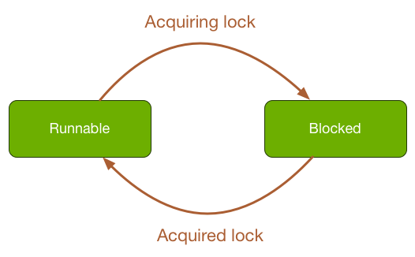
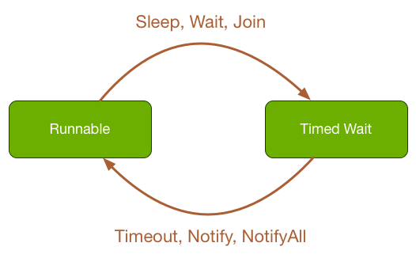

# Execution Units

---
# Execution Units
1. Process
2. Thread

---
# Process
1. Self-contained environment:
    - Virtual address space
    - Executable code
    - Privileges
    - Resources (files, sockets)
2. Most of applications are single process
3. Multiple processes application: Chrome

---
# Process States


---
## Inter Process Communication
- Socket
- Shared Memory
- Pipe 

---
# Multithreaded Process


---
# Thread State
WAITING is TIMED_WAITING with infinite timeout (0 means INFINITE)


---
# Steps to create threads
1. Extends `Thread class` and override `run method`
2. Or implements `Runnable Interface` and implements `run method`
3. Create new execution as a regular object
4. Call `start` to start a thread

---
## Extends Thread class

```java
class PrimeCalculation extends Thread {
    long minPrime;

    PrimeThread(long minPrime) {
        this.minPrime = minPrime;
    }

    public void run() {
    // compute primes larger than minPrime
    }
}

PrimeCalculation p = new PrimeCalculation(143);
p.start();

```     

---
## Implements Runnable

```java
class PrimeCalculation implements Runnable {
    long minPrime;

    PrimeThread(long minPrime) {
        this.minPrime = minPrime;
    }

    public void run() {
    // compute primes larger than minPrime
    }
}

PrimeCalculation p = new PrimeCalculation(143);
p.start();

```
---
# Blocked State
Calling `synchronized` method/block is to acquire an intrinsic lock.



---
# Timed Wait
- `sleep` until timeout
- `wait(timeout)` until other threads call `notify` or `notifyAll`
- `join` wait until that thread die


---

### Important Methods
- `Thread.start` to start a thread
- `Object.wait` to wait until timeout or other thread wakes up
- `Object.notify` to wake up one of waiting threads
- `Object.notifyAll` to wake up all waiting threads
- `Thread.sleep` to sleep until timeout
- `Thread.join` waits until thread die or time out

---
# CPU Cycles

How to schedule threads?


---
# Scheduling
**Time-slicing:** interrupts the running thread periodically to give other threads a chance to run.

**Other schedulers** consider thread priority

## Context Switch
Context: CPU Registers + Program Counter 

---
# Yield
`Thread.yield` to temporarily pause executing thread and allow other threads to execute

---
# Executor
- Manage thread is still an expensive operation.
- Thread pool or executor contains lightweight exection.

---
# Executor Example

```java
ExecutorService executor = Executors.newFixedThreadPool(poolSize);
class PrimeCalculation implements Runnable {
    long minPrime;

    PrimeThread(long minPrime) {
        this.minPrime = minPrime;
    }

    public void run() {
    // compute primes larger than minPrime
    }
}
excutor.execute(new PrimeCalculation(100));
```


