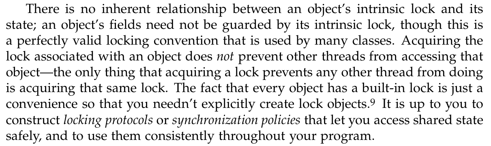

# Synchronization
---
#[fit] Thread is a double-edged sword

---
# Shared data
- All threads can access shared data directly
- Atomicity Issues

---
# Race condition

```java
public class UnsafeSequence {
    private int value = 0;
    public int getNextID() {
        return value++;
    }
}
```
- Thread A & B call getNext
- Duplicated ID


---
# Check and act

```java
if (!list.contains(element)) {
    list.add(element);
}
```
Thread A & B can add the same element.

---
# Inconsistence 
Object is composed multiple parts can be in inconsistent state if race condition happens.

1. Double = 64 bits => needs 2 operations.
2. (d1 <- a1, d2 <- a2)
3. (d1 <- b1, d2 <- b2)
4. Race condition => (d1 is a1) & (d2 is b2)

> For JVM 32 bits

---

##[fit] `Sequence of operations needs to be` ATOMIC

---
## Solution 1: Atomic Variable

```java
import java.util.concurrent.atomic.AtomicInteger;

public class AtomicSequence {
    private AtomicInteger counter = new AtomicInteger(0);
    public int getNext() {
        //int id =  value;
        //value = value + 1;
        int id = counter.incrementAndGet();
        return id;
    }
}
``` 

---
## Solution 2: Intrinsic Lock
Built in lock on all Java object
- Synchronized statements 
- Synchronized Method

---
# Synchronized block

```java
public void addIfNotExist(Element e) {
    synchronized(this) {
        if (!this.contains(element)) {
            this.add(element);
        }
    }
} 
```

Locks current object `this` and `check and act`
`synchronized(lock)` => lock must be object not primitive

---
# Synchronized method

```java
public void addIfNotExist(Element e) {
    synchronized(this) {
        if (!this.contains(element)) {
            this.add(element);
        }
    }
}

public synchronized void addIfNotExist(Element e) {
    if (!this.contains(element)) {
        this.add(element);
    }
}
```

---
# Reentrancy

Intrinsic lock is re-entrant lock.
One thread can acquire the same lock many times.

---
# Common mistakes
1. Only `lock` write operations
2. Select incorrect object to lock (synchronized)
3. Group of statements to lock is too small or too big

---
## Synchronized is a bad design



--


> Brian Goetz - Java Language Architect at Oracle

---
# Visibility Demo
Not always failed

```java
class Reader extends Thread {
  public boolean completed = false;
  public int result;

  public void run() {
    while(!completed){ Thread.yield(); }
    System.out.println("Result: " + result);
  }

  public static void main(String[] args) {
    Reader reader = new Reader();
    reader.start();
    reader.result = 10;
    reader.completed = true;
  }
}

```

---
# Visibility Issues
- Updating values may not be visible
- Reordering 

Declare variable with `volatile` to force JVM to make changes visiable

*Taking advantage of multipleprocessors*


