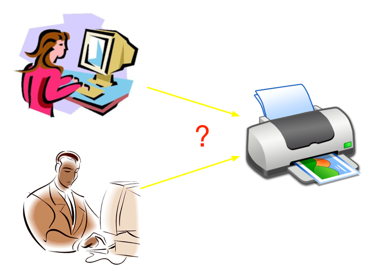
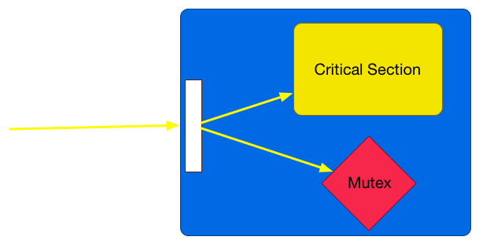

# Mutex
---
## Mutex = Mutual Exclusive


Mutex serializes accesses to a critical section

---
# Critical Section
Critical section will be corrupted if executed concurrently by more than one thread

#[fit] Corrupted means race condition happens

---


---
## Solution
- Put a Manager to manage printer
- For each person wants to print, follows steps:

1. P requests Manager the **exclusive token** to print
   - If token is available, Manager gives token
   - Otherwise P has to wait until Manager calls
2. Prints 
3. Returns the exclusive token to Manager

---


---
## Mutex <-> Critical Section
- No physicially connection
- Only logically connection

### Manager is put to manage printer

---
# Critical Section should not be accessed directly


---
# Java Mutex

```java
import java.util.concurrent.locks.*;
 class X {
   private final ReentrantLock lock = new ReentrantLock();

   public void fooMethod() {
     //Do not access Critical Section

     lock.lock();
     try {
       //Access Critical Section
     } finally {
       lock.unlock()
     }

     //Do not access Critical Section
   }
 }
```

---
#[fit] But every Java Object has built-in lock

---
# Built-in Lock

```java
 class X {
   private final Object lock = new Object();

   public void fooMethod() {
     //Do not access Critical Section

     synchronized(lock){
        //Access Critical Section
     }

     //Do not access Critical Section
   }
 }
```

---
# [fit] `synchronized` is a built-in mutex
---


# [fit] What happen if only one mutex is used?
---
# What's wrong?
```java
public class Queue {
  private int[] es = new int[10];
  private int index = 0;
  private final Object lockArray = new Object();
  private final Object lockIndex = new Object();

  public void enqueue(int e) {
    synchronized(lockArray) {
      es[index] = e;
    }
    synchronized(lockIndex) {
      index = index + 1;
    }
  }
}
```


