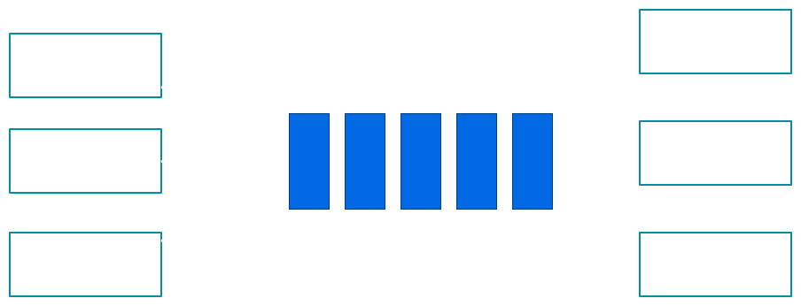

# Semaphore

---
# Semaphore
Invented by Dutch computer scientist Edsger Dijkstra in 1962 or 1963 

---


#[fit] You can sit wherever you wants

---
# Functionality
Keeps track a set of virtual permits or tokens

- `acquire` gets a permit
- `release` returns a permit

### -> Counting Semaphore
### -> Allows number of concurrent executions

---
# Acquire
- Waits until a token available and takes it
- Other names: `wait`, `P`

> wait: If the value of semaphore variable is not negative, decrements it by 1. Otherwise, the process executing wait is blocked (i.e., added to the semaphore's queue) until the value is greater or equal to 1. [Wikipedia](http://en.wikipedia.org/wiki/Semaphore_(programming))

---
# Release
- Puts token back, can release "blocking acquirer"
- Other names: `signal`, `V`

> signal: Increments the value of semaphore variable by 1. After the increment, if the pre-increment value was negative (meaning there are processes waiting for a resource), it transfers a blocked process from the semaphore's waiting queue to the ready queue. [Wikipedia](http://en.wikipedia.org/wiki/Semaphore_(programming))

---
# P & V

P = Probeer ('Try')

V = Verhoog ('Increment', 'Increase by one').

> [Origins of P( ) and V( )](https://cs.nyu.edu/~yap/classes/os/resources/origin_of_PV.html)

> [Linus Torvalds on semaphores](https://news.ycombinator.com/item?id=8761539)

---
#[fit] A Binary Semaphore is a Mutex
### Except special properties

---
# Skeleton
```java
public class Semaphore {
    private int permits;
    
    public Semaphore(int permits){
        this.permits = permits;
    }
    
    public void acquire() {

    }

    public void release() {

    }    
}
```

---
# Acquire Requirements
- Thread-safe
- Waits until a permit be available

---
# Wait() pattern
```java
synchronized (obj) {
    while (<condition does not hold>)
        obj.wait();
    // Perform action appropriate to condition
}
```

---
# Acquire Impl
```java
public synchronized void acquire() {
    while(permits <= 0) {
        try { 
            wait(); 
        } catch(InterruptedException e){}
    }
    --permit;
}
```

---
# Release requirements
- Thread-safe
- Returns a permit
- Notify to one of waiting acquirers

---
# Release Impl
```java
public synchronized void acquire() {
    ++permits;
    if(permits <= 1){
        notify();
    }
}
```

---
```java
public class Semaphore {
    private int permits;
    
    public Semaphore(int permits){
        this.permits = permits;
    }
    
    public synchronized void acquire() {
        while(permits <= 0) {
            try { 
                wait(); 
            } catch(InterruptedException e){ }
        }
        --permit;
    }

    public synchronized void acquire() {
        ++permits;
        if(permits <= 1){
            notify();
        }
    }
}
```

---
# JDK Implementation
java.util.concurrent.Semaphore

---
# Consumer-Producer



---
```java
import java.util.concurrent.Semaphore;

class BoundedQueue<E> {
  private final Queue<E> elements = new LinkedList<E>()
  
  public BoundedQueue(int size) {

  }

  public synchronized void put(E e) {

  }

  public synchronized E take() {

  }
}
```

---
# Initialization
```java
import java.util.concurrent.Semaphore;

class BoundedQueue<E> {
  //Indicates number of empty slots
  private final Semaphore emptyCount;

  //Indicates number of filled slots
  private final Semaphore filledCount;

  public BoundedQueue(int size) {
    emptyCount = new Semaphore(size);
    filledCount = new Semaphore(size);
    filledCount.acquire(size);
  }
}
```

---
# Substitution

- `Acquire | Wait` => means decrease
- `Release | Signal` => means increase

---
# Put Operation
1. Acquires an empty slot
2. Put element
3. Increase filled slots

```java
class BoundedQueue<E> {
    public void put(E e) {
        emptyCount.acquire();
        synchronized(this) {
            elements.add(e);
        }
        filledCount.release();
    }
}
```

---
# Take Operation
1. Acquire a filled slot
2. Take element
3. Increase empty slots

```java
class BoundedQueue<E> {
  public E take() {
    filledCount.acquire();
    synchronized(this) {
        E e = elements.remove();
    }
    emptyCount.release();
    return e;
  }
}
```

---
```java
import java.util.concurrent.Semaphore;
import java.util.LinkedList;
import java.util.Queue;

class BoundedQueue<E> {
  private final Queue<E> elements = new LinkedList<E>();
  private final Semaphore emptyCount;
  private final Semaphore filledCount;
  
  public BoundedQueue(int size) throws InterruptedException {
    emptyCount = new Semaphore(size);
    filledCount = new Semaphore(size);
    filledCount.acquire(size);
  }

  public void put(E e) throws InterruptedException {
    emptyCount.acquire();
    synchronized(this){
        elements.add(e);
    }
    filledCount.release();
  }

  public E take() throws InterruptedException {
    final E e;
    filledCount.acquire();
    synchronized(this){
      e = elements.remove();
    }
    emptyCount.release();
    return e;
  }
}
```

---
# Course Resources
1. [Semaphore Implementation](http://www.aimanhanna.com/concordia/comp346/semaphore.java.txt)
2. [Producer and Consumer](http://www.aimanhanna.com/concordia/comp346/producer_consumer.zip)

