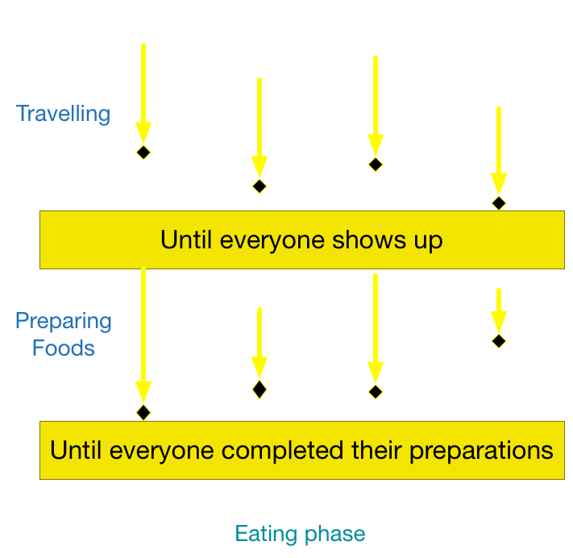

# Barrier

---
# Barrier
- Synchronization point
- Only able to cross a barrier if ALL are ready

---


---
# Cellular Automata
[Game of Life](http://en.wikipedia.org/wiki/Conway's_Game_of_Life)

- Elements must be updated iteration by iteration
- All elements must be updated in iteration N before processing N+1

---
"Until **all shows up**, and then we’ll start preparing meals"
### Solution
1. Make N "receipts"
2. When one comes, takes a receipt. Is it the last receipt?
- YES: Tells people that all shows up
- NO: Sits and waits for others.

---
# Skeleton
```java
public class Barrier {
    private int receipts;
    public Barrier(int parties) {
        this.receipts = parties;
    }

    public void await(){
        //Take receipts
        //If the last receipt, inform other to cross
        //Waits until all ready
    }
}
```

---
```java
public class Barrier {
    private int receipts;

    public Barrier(int parties) {
        this.receipts = parties;
    }

    public synchronized void await() throws InterruptedException {
        --receipts; //Take receipts
        //If the last receipts, inform all to cross barrier
        if(receipts == 0) { 
            notifyAll();
        }else { //Otherwise waits until all ready
            while(receipts > 0)
             wait(); 
        }
    }
}
```

---
# Test
```java
class Participant implements Runnable {
    private String name;
    private int snooze;
    private int distance;
    private Barrier barrier;

    Participant(String name, int snooze, int distance, Barrier barrier) {
        this.name = name;
        this.snooze = snooze;
        this.distance = distance;
        this.barrier = barrier;
    }
    
    private void travel() throws InterruptedException {
        System.out.println(name + " going to snooze: " + snooze);
        Thread.sleep(snooze);
        System.out.println(name + " starts travelling: " + distance);
        Thread.sleep(distance);
        System.out.println(name + " arrived");
    }
    
    private void prepareFood() {
        System.out.println(name + " starts prepare food");
    }
    
    public void run(){
        try {
            travel();
            barrier.await();
            prepareFood();
        }catch(InterruptedException ignored) {

        }
    }
}
```

---
# Test
```java
public class TestBarrier {

    public static void main(String[] args) throws InterruptedException {
        Barrier barrier = new Barrier(4);
        Thread a = new Thread(new Participant("A", 0, 1000, barrier));
        Thread b = new Thread(new Participant("B", 2000, 2000, barrier));
        Thread c = new Thread(new Participant("C", 1000, 2000, barrier));
        Thread d = new Thread(new Participant("D", 4000, 1500, barrier));

        a.start();
        b.start();
        c.start();
        d.start();
    }
}
```

---
# JDK CyclicBarrier
java.util.concurrent.CyclicBarrier

`await()`: Waits until all parties have invoked await on this barrier.

---
# Barrier using Semaphore
1. Make a semaphore with count = 0. No one is allowed to cross
2. When one comes, takes a receipt. If the last receipt signals the semaphore
3. Acquire semaphore and release immediately

[Page 29(41) - The little book of semaphore](http://greenteapress.com/semaphores/downey08semaphores.pdf)

---
```java
public class SemaphoreBarrier {
    private int receipts;
    private Semaphore sem;
    public Barrier(int parties) {
        this.receipts = parties;
        sem = new Semaphore(0); //No one allow to cross
    }
    public synchronized void await() throws InterruptedException {
        synchronized(this) {
            --receipts; //Take receipts
            if(receipt == 0)
                sem.signal();
        }
        sem.wait();
        sem.signal();
    }
}
```

---