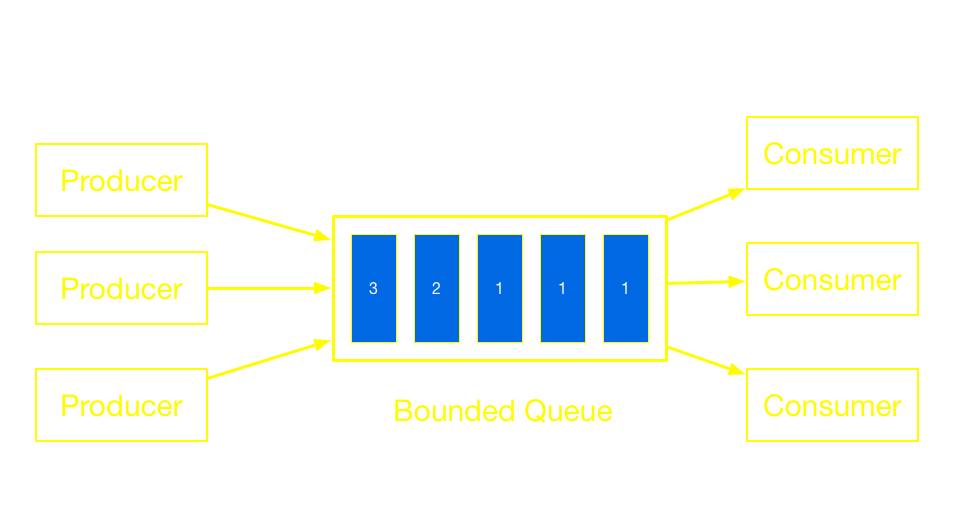
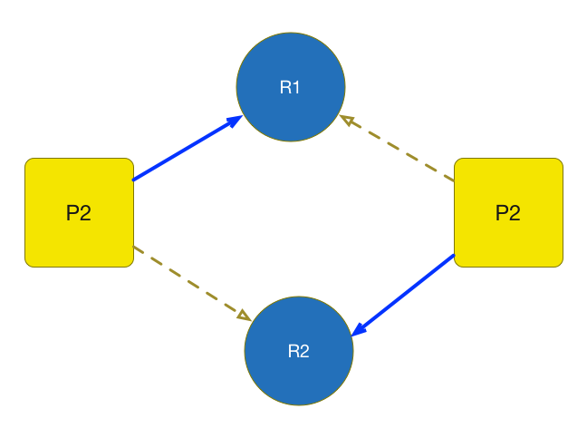
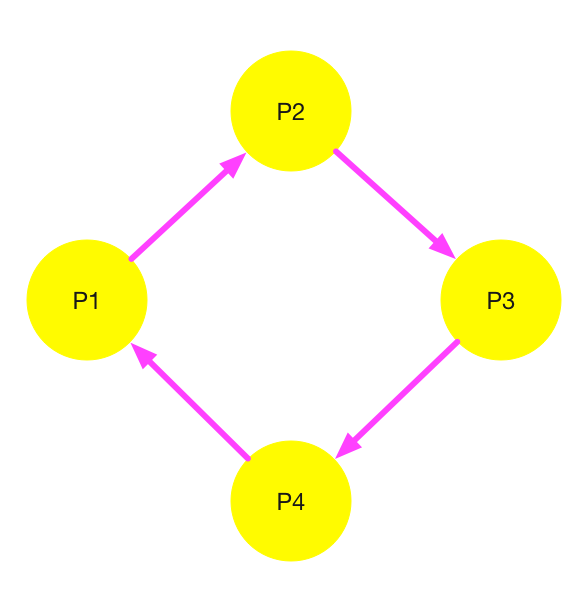

#[fit] Safety and Liveness
---
# Safety
Something bad never happens

---
# Liveness
Something good eventually happens

---
# Safety vs Liveness 
Using synchronization 

- To achieve **safety** 
- But can prevent **liveness**
- And can reduce **throughput** (performance)

---
# Liveness Issues
1. Starvation 
2. Livelock
3. **Deadlock**
4. Poor responsiveness

---
# Starvation
Starvation describes a situation where a thread is unable to gain regular access to shared resources and is unable to make progress.



---
# Livelock
Participants continuously change their state in response to the action of another thread.
1. A move to his left to let B pass
2. B move to his right to let A pass


---
# Poor Responsiveness
- Common in GUI applications
- Occurs when user interface freeze

# Solution:
Long running tasks should be executed by background threads 

---
# Deadlock
Deadlock arises when several participants are waiting on each other to reach a specific state to be able to progress. 

As none of them can progress without some other participant to reach a certain state.

---
# Dining Philosophers
Eating requires 2 chopsticks


---
# Lock-ordering



---
# Deadlock occurs if all hold
1. **Mutual Exclusion:** at least one process exclusively uses a resource
2. **Hold and wait:** a process holds at least one resources and needs more, which are held by others
3. **No preemption:** resources are released only in voluntary manner
4. **Circular wait:** P1 → P2 → … → PN → P1


---
# Deadlock Analysis
- Processes are nodes
- Edges are resource relations
- Cyclic => Deadlock



---
# Dynamic Lock-ordering

```java
public void transferMoney(Account fromAcc, Account toAcc, amount) {
  synchronized (fromAcc) { 
    synchronized (toAcc) {
      fromAccount.debit(amount);
      toAccount.credit(amount);
    }
  }
}   
```
Can deadlock occur ?

---
# Deadlock happens if

A transfer to B and B transfer to A at the same time.

- transferMoney(A, B, _);
- transferMoney(B, A, _);

---
# Solution 1

```java
public void transferMoney(Account fromAcc, Account toAcc, amount) {
  synchronized(this) {
    synchronized (fromAcc) { 
      synchronized (toAcc) {
        fromAccount.debit(amount);
        toAccount.credit(amount);
      }
    }
  }
}  
```
Condition 2 & 4 are not held.
But new problem ???

---
# Solution 2
- Ordering lock operations
- Account number is comparable
- No two accounts are equal

---
# Solution 2 (cont)
```java
if(fromAcc < toAcc) {
  synchronized(fromAcc){
    synchronized(toAcc) {

    }
  }
}else {
  synchronized(toAcc) {
    synchronized(fromAcc) {

    }
  }
}
```

---
#[fit] Deadlock is not obvious

---
```java
class Vehicle {
  Date beginTim, endTime;
  synchronized getBeginTime(){
    return beginTime;
  }
  synchronized enter(){
    beginTime = Date();
    station.notifyParking(this);
  }

  synchronized leave(){
    endTime = Date();
    station.notifyLeaving(this)
  }
}
```

---
```java
class Station {
  List[Vehicle] vehicles;
  
  synchronized notifyParking(Vehicle v){
    vehicles.add(v);
  }

  synchronized notifyLeaving(Vehicle v){
    vehicles.remove(v);
  }

  synchronized scans() {
    for(v in vehicles) {
      if(Date()  - v.time > 1 day) {
        //Issue fine tickets
      }
    }
  }
}
```

---
# Deadlock can occur if
Call leave and scans at the same time
- `leave()`: first lock the vehicle, then lock station
- `scans()`: first lock station, then lock vehicles

**Deadlock is even harder to detect with multiple coopering objects**

---
# Open Call
Calling a method with no locks held is called an open call

---
```java
class Vehicle {
  Date beginTime, endTime;
  synchronized getBeginTime(){
    return beginTime;
  }
  enter(){
    synchronized(this){
       beginTime = Date();
    }
    station.notifyParking(this);
  }

  leave(){
    synchronized(this){
      endTime = Date();
    }
    station.notifyLeaving(this)
  }
}
```

---
```java
class Station {
  List[Vehicle] vehicles;
  
  synchronized notifyParking(Vehicle v){
    vehicles.add(v);
  }

  synchronized notifyLeaving(Vehicle v){
    vehicles.remove(v);
  }

  scans() {
    now = Date();
    synchronized(this){
        current = vehicles.copy();      
    }
    for(v in current) {
      if(now  - v.time > 1 day) {
        //Issue fine tickets
      }
    }
  }
}
```

---
# Dealing with deadlock
- Ignore
- Prevent
- Detect & Recover

---
# Ignore deadlock
Allow deadlock happens and ignore if 
- Deadlock is rare
- If happens, consequence is not too severe

---
# Prevent deadlock
Prevent deadlock by assuring at least 1 of 4 condition does not hold

---
# Detect and recover
- Database Management System (DBMS)
- Allows deadlock happen then
1. Detects deadlock
2. Terminate one or all
3. Remained processes can execute

---
# Deadlock practices
1. Uses single lock if possible
2. When has to use multiple locks
   - Minimize the set of lock
   - Ordering the set of lock
3. Open call methods

---
# Summary

1. Deadlock is one of the biggest issues of concurrency
2. Deadlock is not obvious
3. Four conditions of deadlock

