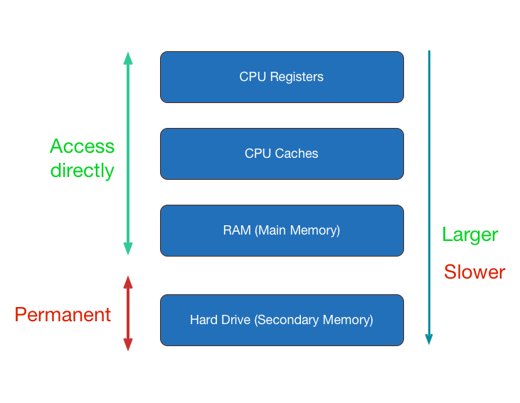

# Memory Management

---
# Resources
1. CPU Cycles
2. Memory
3. Peripheral

---
# Hierarchy

---
# Issues 1
- Main memory is 1GB
- Needs to run 10 applications each requires 200MB
- Total needed memory 2GB

## => Share main memory between applications

---
# Issue 2 (Derived from 1)
- App A not allowed access app B's space

## => Apps not allowed to access Memory directly

---
# Issue 3
- Main memory is 1GB
- Application requires 2GB

## Solution 
- Memory is allocated on demand
- Inactive part is flushed to disk

---
# Virtual Memory

---
# How it works
- Application accesses its virtual memory
- Memory is divided up into pages (fixed size)
- CPU & OS manage mapping

---
# Address Translation

Translation is done by MMU (Memory Management Unit)

---
# Problems
1. Which page to be removed from memory
2. Handle unavailable page (page fault)

---
# Page out
- Remove unused pages from memory
- Store if modified otherwise just discard

## => Page Aging Technique
Linux uses `Least Recently Used`

---
# Page fault
If page is unavailable, then

1. Stop current execution
2. Load requested page to memory
3. Restore the execution

---
# Other benefits
- Processes can share memory
- Isolation
- Protection

