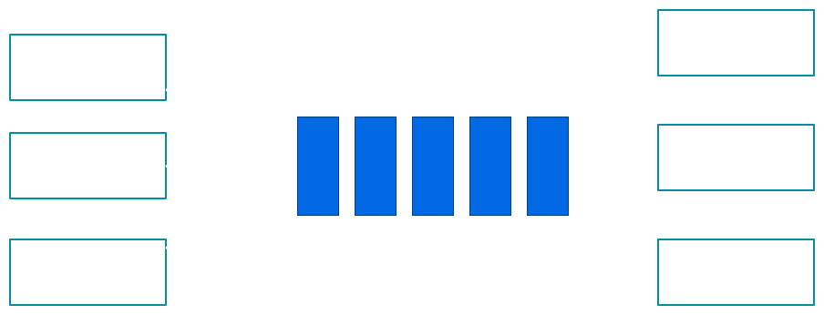

# Monitor Mechanism

---
# Producer -> Consumer 


---
# Consumer Events
"Consumer will be blocked while queue is empty"

**Question:**
How do the blocked consumers know when the queue becomes non-empty

**Answer:**
1. Keeps spinning and tests the queue
2. Blocked consumer will be notified when queue changed

---
# Condition
- It can be alias of expression: `!queue.isEmpty`
- Must be `protected` to prevent race condition
- Must be read `exclusively` by Consumer
- Must be write `exclusively` be Producer

---
# Race condition
```java
take(){
  //Spinning while queue is empty
  while(queue.isEmpty){

  }
  queue.remove()
}

put(e){
  queue.add(e)
}
```

---
# With Lock
```java
take(){
  synchronized(this){
    //Spinning while queue is empty
    while(queue.isEmpty){

    }
    queue.remove()
  }
}

put(e){
  synchronized(this){
    queue.add(e)
  }
}
```

---
# But deadlock

- Take: acquired lock & waits for condition from `put`
- Put: waits for a lock which acquired from put

=> `take` should release `lock` to let `put` change the condition

---
# Spinning with lock
```java
take(){
  acquireLock()
  while(queue.isEmpty) {
    releaseLock()
    acquireLock()
  }
  queue.remove()
  releaseLock()
}

put(e){
  acquireLock()
  queue.add(e)
  releaseLock()
}
```

---
# Spinning Approach
- Consistent result
- But waste of CPU Cycles

---
# Condition Variable
A condition that thread can
- `wait`: waits until condition occurs
- `signal`: wakes up one of waiting threads
- `broadcast`: wakes up all waiting threads

## All operations must be executed when acquired lock

---
# wait(condition, lock)
1. Release lock
2. Sleep until `condition` is signalled
3. When awaken up, re-acquire lock again

---
# signal(condition, lock)
- Caller must hold `lock`
- Wakes up one of waiting threads

---
# broadcast(condition, lock)
- Caller must hold `lock`
- Wakes up all waiting threads

---
# Java Monitor
- Every Java object is Monitor
- `wait` <-> `wait`
- `signal` <-> `notify`
- `broadcast` <-> `notifyAll`

---
# With Java Monitor
```java
take(){
  synchronized(this){
    while(queue.isEmpty)
      this.wait()
    queue.remove() 
  }
}

put(e){
  synchronized(this){
    queue.add(e)
    this.notify()
  }
}
```

---
# Notes
`wait`, `notify`, `notifyAll` must be called within `synchronized`

---
