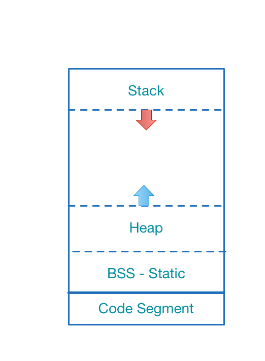

# InProcess Memory Structure

---
# Structure



Data Segment
  - BSS
  - Heap
  - Stack

Data Segment is dynamic

Code Segment is readonly

---
# BSS
- Global variables
- Constant values
- Static variables

---
# Stack
Behaves like `Regular Stack` (LIFO)

**Push when**
  - Enter scope (function or loop)
  - Declare primitive variables

**Pop when**
  - Exit scope (function or loop)

---
# StackOverflow
- Overflow when calling many functions nestly
- Common issue of non-tail recursive functions

---
```java
class Overflow {
  static int count = 0;
  static void repeat(){
    count += 1;
    repeat();
  }

  public static void main(String[] args){
    try{
      repeat();
    }catch(Throwable e){
      System.err.println("Completed times: " + count);
      System.err.println("Reason: " + e);
    }
  }
}
```

Completed times: 22127
Reason: java.lang.StackOverflowError

---
# Manage Stack Segment
- No, it is handled automatically by process
- Avoid "very long recursive calls"

---
# Heap
- Dynamic allocation memory
- Allocated memory when creating objects
- Deallocated memory when release objects

---
# Manual Heap
- C: malloc/free 
- C++: new/delete

---
# Garbage Collection(GC)
- Java
- C#
- Go
- Javascript

---
# Mixed (Reference Counting)
- Swift
- Objective-C
- Rust
- C++ (Smart Pointer)

---
# OutOfMemory
```java
class OutOfMemory {
  public static void main(String[] args){
    int GB = 1024 * 1024 * 1024;
    Object[]os = new Object[10 * GB];
  }
}
```
Exception in thread "main" java.lang.OutOfMemoryError: Java heap space
  at OutOfMemory.main(OutOfMemory.java:4)

---
# Cyclic Reference
- `Object A` has **STRONG** reference to `B`
- `Object B` also has **STRONG** reference to `A`
- GC or ARC can not break **CYCLIC REFERENCE**
- GC languages still have `Memory Leaks` issues

